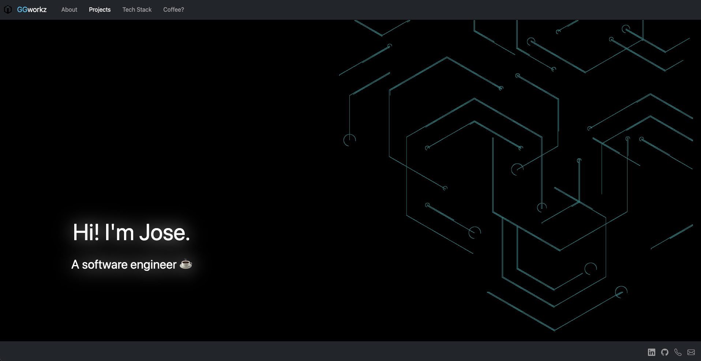
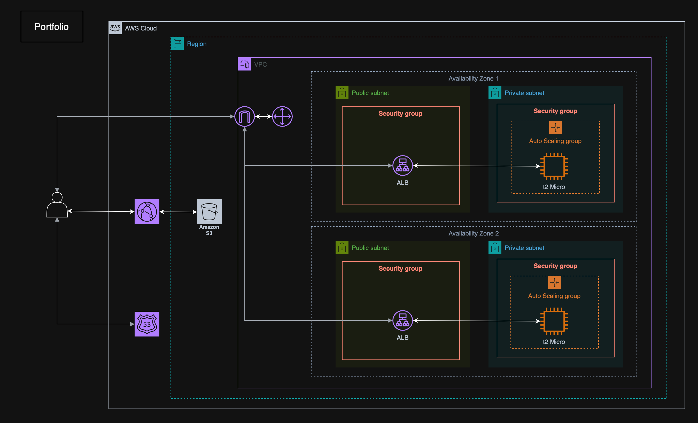

# [Portfolio Webpage](https://ggworkz.co)

🖥️ **Personal Portfolio Website**

Developer Portfolio page using React and Bootstrap front end technologies.
Hosted using AWS with Route53, Load Balancing, EC2 and S3.

**Designed as a portfolio piece to showcase software engineering best practices.**

---

## Portfolio Focus

This project was designed as a **demonstration of software engineering practices** applied to front-end development.

### Frontend Architecture

- **Component-Based Design**: Modular components using **TypeScript** allows for quick refactoring.
- **Separation of Concerns**: Content (JSON), layout (Sections), and visuals (SVG/Background) are decoupled.
- **Mobile Friendly**: Responsive styling on all components with adaptive sizing.

### Cloud Hosting

- **AWS EC2 Hosting**: Deployed behind an **Application Load Balancer** for reliability.
- **Route 53 DNS + HTTPS**: Route 53 with SSL/TLS termination handled through AWS ACM.
- **Secure & Resilient**: HTTPS enforced end-to-end with health checks through the load balancer.

### Software Engineering Practices

- **Data-Driven Design**: `portfolio.json` allows updates, configuration and extension without code changes.
- **Reusable Components**: Composition-first approach for sections, navbars, and project modules.
- **Clean File Structure**: Each feature encapsulated in its own component file for clarity.
- **Fast Iteration**: Integrated Bootstrap/React-Bootstrap for rapid layout while maintaining a custom aesthetic.

---

## Features

- **UI/UX**

  - **Responsive** layout (Bootstrap / React-Bootstrap) across mobile, tablet, desktop
  - Smooth anchor navigation and clear section hierarchy
  - Consistent typography, spacing, and component theming

- **Projects & Content**

  - **JSON-driven portfolio** (`portfolio.json`) — add/update projects without code changes
  - Configurable project metadata (title, caption, image, position, color)

- **Accessibility & Performance**
  - Semantic landmarks, alt text for images/icons
  - Mobile-first layout and keyboard navigability
  - Optimized static build (Vite) with asset minification

---

## Tech Stack

- **Framework**: React + TypeScript
- **UI Library**: Bootstrap 5 and React-Bootstrap
- **State & Data**: JSON-driven content (`portfolio.json`) for projects and configuration
- **Build Tooling**: Vite
- **Cloud Hosting**: AWS

---

## Screenshots

### 🏙️ UI

### ☁️ Architecture

---
